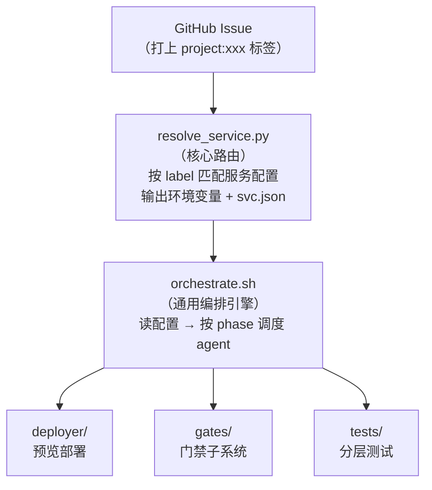

# backLog 工程架构解读 —— 聚焦 .ai-flow 运行机制

> 解读时间：2026-06-09

---

## 一、工程定位

**backlog** 是 openEuler 社区基础设施团队的需求与交付管理仓库。它不只是一个文档仓库，更是一个 **AI 驱动的全自动软件开发流水线控制中心**。

核心能力：

- 管理需求全生命周期（需求分析 → 架构设计 → 测试 → 发布 → 复盘）
- 团队知识沉淀（`context/`）
- **`.ai-flow/` 是整个工程的"操作系统"——AI Agent 编排 + K8s 预览部署 + 门禁自动化 + 服务注册**

---

## 二、.ai-flow 目录结构总览

```
.ai-flow/
├── config/                          # OpenCode AI CLI 配置
│   └── opencode.requirement-analysis.json
├── services/                        # 服务注册表（20 个 YAML，引擎适配层）
│   ├── _TEMPLATE.yaml               # 新服务接入模板
│   ├── calculator.yaml              # 各服务具体配置
│   ├── meeting-server.yaml          # 最完整的全栈服务示例
│   ├── robot.yaml
│   └── ...
├── skills/                          # AI 操作指南（接新服务、预览踩坑）
│   ├── add-service.md
│   └── preview-onboarding.md
├── src/                             # ═══ 核心引擎 ═══
│   ├── orchestrate.sh              # ★ 通用两阶段自动开发引擎（1458 行）
│   ├── deployer/                    # K8s 预览部署子系统
│   │   ├── README.md                #   部署约定
│   │   ├── deploy.sh                #   runtime-clone 部署入口
│   │   ├── preview-pod.yaml         #   Pod 模板（Go/Node/Python 自动探测）
│   │   ├── preview-ingress.yaml     #   Ingress 模板（通配符域名）
│   │   └── lib/
│   │       └── runtime_clone_pod.sh #   单子仓 runtime-clone helper
│   ├── gates/                       # 门禁子系统
│   │   ├── run.sh                   #   门禁主入口（检查→修复→重检循环）
│   │   ├── checks.sh                #   各项检查实现（218 行）
│   │   ├── fixes.sh                 #   自动修复逻辑
│   │   ├── lib.sh                   #   共享工具
│   │   └── security_gate_local.sh   #   PR 前 security-gate 预跑
│   └── tests/
│       └── run_layered.sh           # 分层测试/部署调度
└── scripts/                         # Python/Shell 工具脚本（26 个）
    ├── resolve_service.py           # ★ 核心路由：按 Issue label 匹配服务配置
    ├── add_service.py               # 新服务接入脚手架
    ├── progress_bar.py              # 进度条渲染
    ├── format_deploy_json.py        # 部署结果格式化
    └── ...
```

---

## 三、核心设计理念：「引擎不动 + YAML 驱动」

这是 .ai-flow 最核心的哲学：

```
接新服务 = 加一个 services/<id>.yaml
            ↓
    不改引擎   不改 workflow   不写脚本
```

### 架构图



---

## 四、三段式工作流（A → B → C）

.ai-flow 驱动的完整开发生命周期分为三个 Phase：

### Phase A：需求分析（workflow: issue-accepted）
- 触发方式：Issue 创建时自动触发 `/ai-requirement-analysis`
- AI agent 产出需求分析说明书，自动评估需要打的标签（`need_security`、`need_design`、`need_itest` 等）

### Phase B：需求实现（workflow: workflow-develop）★核心

这是 .ai-flow 最复杂的部分，由 `orchestrate.sh` 驱动，分为两个子阶段：

#### B1: preview 段（`/ai-develop-preview`）
```
design → dev → deploy → tester（冒烟）→ 回评预览
   │                              │
   └── 设计 PR 并行自动评审 ──────┘
```
- 快速出一个能跑的预览让人看，不开代码 PR
- 冒烟只做 1 轮 best-effort
- 设计文档 PR **在 dev 开始前**就推出去让人先看
- 设计自动评审闭环与 dev 代码流程 **并行跑**，互不影响

#### B2: submit 段（`/ai-develop-submit`）
```
design → dev → deploy → review(门禁+对抗) → tester(完整测试) → security-gate 预跑 → 开PR
```
- 默认 1 轮 best-effort（对抗模式需 `ADVERSARIAL_MODE=1`）
- 门禁 + reviewer + tester 全跑过后才开 PR
- 开 PR 前在本地预跑 security-gate 6 项检查

### Phase C：上线测试（workflow: workflow-deploy-test）
- 构建镜像 → 推到华为云 SWR → 改 GitOps 仓 → ArgoCD 同步 → 集成测试

---

## 五、orchestrate.sh —— 通用两阶段引擎详解

`src/orchestrate.sh` 是整个 .ai-flow 的"心脏"（1458 行），以下是其关键机制：

### 5.1 入参（全部通过环境变量注入）

| 环境变量 | 用途 | 来源 |
|---------|------|------|
| `REPO_FULL` / `ISSUE_NUMBER` | Issue 定位 | workflow 传入 |
| `ORG` / `UMBRELLA` | 目标仓库 | `resolve_service.py` 解析 |
| `BRANCH` | 功能分支名（默认 `issue-<N>-impl`） | workflow 传入 |
| `GH_TOKEN` | GitHub 认证 | GitHub Actions secret |
| `WORK_DIR` | umbrella checkout 目录 | workflow clone 后 |
| `KUBECONFIG` | ai-test 集群 kubeconfig | workflow secret |
| `PHASE` | `preview` / `submit` / `deploy_pr_only` | 按触发评论推断 |
| `MAX_FIX_ROUNDS` | 最大对抗修复轮次（默认 5） | 可选 |
| `AI_CLI` / `OPENCODE_MODEL` | AI CLI 与模型 | 默认 `opencode / alibaba-cn/glm-5` |

### 5.2 特殊模式（通过 flag 切换）

| 模式 | 标志 | 行为 |
|------|------|------|
| `--design` | `FORCE_UPDATE_DESIGN=true` | 只更新设计文档，不进 dev/deploy |
| `--skip-design` | `SKIP_DESIGN=true` | 设计冻结，按已定稿 design.md 直接开发 |
| `--deploy-only` | `DEPLOY_ONLY=true` | 不跑任何 agent，只重部署已有分支预览 |
| `--pr` | `PR_URL=...` | 部署其他仓库 PR 的预览（`deploy_pr_only` 段） |

### 5.3 Agent 编排

orchestrate.sh 管理 5 种 AI Agent（角色提示词来自 `agent-development-specification` 仓）：

| agent 别名 | spec 角色目录 | 职责 |
|-----------|-------------|------|
| `design` | `designer/AGENT.md` | 产出/修订 design.md（技术设计+验收标准） |
| `dev` | `developer/AGENT.md` | 按 design.md 改代码 |
| `review` | `reviewer/AGENT.md` | 门禁检查 + 对抗式代码评审 |
| `tester` | `tester/AGENT.md` | UT + 接口冒烟 + 功能测试 |
| `requirements` | `requirements-analyst/AGENT.md` | 需求分析 |

每个 agent 调用通过 `run_agent()` 函数：

```bash
run_agent() {
  local agent="$1"; shift
  local rolefile="$SPEC_DIR/spec/teams/agents/${roledir}/AGENT.md"
  local role="$(cat "$rolefile" | ...模板替换...)"
  local prompt="${role}\n\n================ 本次任务 ================\n..."
  opencode run "$prompt" --model "$OPENCODE_MODEL" --agent build --dangerously-skip-permissions --thinking=false
}
```

### 5.4 分支管理

`prime_branches()` 函数在每轮开始前执行：

1. 检查各 dev 子仓是否已有 `issue-N-impl` 分支
2. 如果有 → checkout 到该分支，dev 在已有实现上**增量**开发
3. 自动同步 base 分支（merge `origin/main` 或 `.gitmodules` 配置的集成分支）避免 PR 冲突
4. 提取已有实现摘要注入 dev agent，防止重复造轮子

### 5.5 设计文档 PR 自动版本管理

`push_design_pr_now()` 实现了精巧的设计 PR 版本策略：

- **首次** → 创建 `issue-N-impl-design` 分支
- **已有 open 设计 PR** → 更新该分支
- **所有设计 PR 已合入 + 用户要求更新** → 创建新版本 `issue-N-impl-design-v2`（v3, v4...）
- **[缺陷]/[任务]** 类型 Issue → 不产生《需求设计说明书》，不开文档 PR

### 5.6 设计自动评审闭环

`design_review_merge_loop()` 与 dev 流程**并行执行**（通过 `&` 后台）：

```
reviewer 评审设计文档 → PASS → 自动 squash-merge 设计 PR
                     → FAIL → design agent 按意见改 → 重推分支 → 重评审（≤3 轮）
                     → 用尽 → 留 PR 给人
```

关键设计：用设计文档**独立副本** `$WS/design_review/design.md`，完全不碰 dev 在用的 `$WS/design.md`。

### 5.7 commit + push 策略

`commit_push_branch()` 功能丰富：

1. **分支名纠偏**：dev agent 可能自己起 `issue-N-语义` 分支名，自动强制重命名为约定 `issue-N-impl`
2. **stash 保护**：切分支前自动 `git stash` 保存 dev 未提交改动
3. **lockfile 回滚**：自动 revert `package-lock.json` / `pnpm-lock.yaml` 等自动生成文件
4. **白名单 add**：只 stage 业务文件（`*.vue/ts/tsx/md/yaml/py/sh` 等），排除 `node_modules`/`dist`
5. **分支基础选择**：优先基于 `.gitmodules` 配置的集成分支（如 datastat=beta）建分支，而非默认 main

### 5.8 主循环逻辑（preview 段 vs submit 段）

**preview 段**（1 轮）：
```
design → push_design_pr_now → 启动设计评审闭环(&) → dev → commit_push → deploy → tester冒烟 → break
```
- 不管冒烟 PASS/FAIL 都 break
- FINAL_STATUS = `preview` 或 `preview_partial`

**submit 段**（默认 1 轮，对抗模式最多 5 轮）：
```
design → dev → commit_push → deploy → gates/run.sh → review → tester → security-gate预跑 → promote_to_pr → 回评
```
- 对抗模式（`ADVERSARIAL_MODE=1`）：FAIL 时写 feedback.md → 回到 design 下一轮
- 默认模式：1 轮 best-effort，结果直接开 PR

---

## 六、服务注册与路由机制

### 6.1 服务注册表（services/*.yaml）

每个 YAML 定义三段配置，以 `_TEMPLATE.yaml` 为例：

```yaml
service:
  id: <service-id>
  name: <中文名>
  label: project:<umbrella-repo>    # ★ Issue 打这个标签就路由至此

implement:
  tools_repo: <org>/<umbrella>      # 级联仓
  tools_ref: main

preview:                            # 预览部署目标（可选）
  cluster: infra-hk-preview-cluster-003
  namespace: <service-id>
  ingress_domain: preview.test.osinfra.cn

release:                            # 上线测试配置
  swr_endpoint: swr.cn-north-4.myhuaweicloud.com
  image_org: opensourceway
  tag_sync:                         # GitOps 镜像归档
    repo: opensourceways/infra-common
    path: common-applications/...
  deploy: k8s | argocd | none
  integration_tests:                # 集成测试
    repo: opensourceways/integration-tests
```

### 6.2 resolve_service.py —— 核心路由

匹配逻辑（246 行，**不依赖 PyYAML**，内置缩进解析器）：

```
1. 遍历 .ai-flow/services/*.yaml（跳过 _ 开头的模板）
2. 匹配 Issue 的 label 与 service.label
3. 命中 → 输出 KEY=VALUE + svc.json
4. 未命中但有 project:<repo> 标签 → 回退默认配置
5. 都没有 → exit 1
```

输出的 `KEY=VALUE` 直接注入 `$GITHUB_ENV`，被后续 workflow steps 使用。

---

## 七、预览部署机制（deployer/）

### 7.1 分层职责

| 层 | 职责 |
|---|------|
| **backlog**（本仓） | 通用骨架：申请 kubeconfig、调 umbrella hook、提供 helper |
| **umbrella 仓** | 服务专属：起 DB/中间件、起业务 Pod、声明 ingress |

### 7.2 默认模式：runtime-clone pod

`deploy.sh` 对每个有改动的 dev 子仓：

1. 按语言选基础镜像：`go.mod` → `golang:1.22` / `package.json` → `node:20` / 否则 → `python:3.12`
2. 创建 per-sub Secret（含 GitHub token 用于 clone 私有仓）
3. 渲染 `preview-pod.yaml`（pod 启动时 `git clone` → 按语言探测执行命令）
4. `kubectl apply` + `rollout status`（240s 超时）
5. 写 `${RUNNER_TEMP}/ai/deploy/<sub>.json`（供 tester 读预览 URL）

### 7.3 自定义模式：umbrella preview.sh

如果 umbrella 仓有 `.ai-flow/deploy/preview.sh`，deploy.sh 完全交权：

- 适用场景：多服务、有数据库/Redis/Kafka 依赖
- umbrella 负责：起中间件、构建镜像、配置 ingress、写 `deploy/<sub>.json`
- backlog 提供 helper（`runtime_clone_pod.sh`）供 umbrella 按需调用

---

## 八、门禁子系统（gates/）

### 8.1 检查项（checks.sh，共 7 项）

| 检查项 | 内容 |
|--------|------|
| 敏感信息 | Gitleaks 扫描硬编码密钥/token |
| 设计文档 | 检查 `issue_docs/` 下是否有设计文档 |
| 漏洞扫描 | `npm audit` / `pip audit` / `go list` |
| 安全编码 | SAST 静态分析 |
| License | 依赖许可证合规 |
| 镜像漏洞 | Trivy 容器镜像扫描 |
| 单元测试 | UT 覆盖率门禁 |

### 8.2 自动修复循环（run.sh）

```
while ROUND ≤ MAX_FIX_ROUNDS:
    run_gates()
    if PASS → break
    if 最后一轮 → break
    if 不可自动修复(license/design) → break
    auto_fix(ROUND)
    ROUND += 1
```

### 8.3 security-gate 预跑

在 submit 段开 PR 之前，本地预跑 PR 上的 security-gate 6 项检查：

- 默认只跑 `gitleaks`（敏感信息），其余 5 项跳过
- `--allgate` 标志才全跑
- 失败后 dev agent 修复 → commit_push → 重跑，最多 `MAX_FIX_ROUNDS` 轮

---

## 九、分层测试（tests/run_layered.sh）

支持两个子命令：

| 子命令 | 行为 |
|--------|------|
| `deploy` | 委托 `deployer/deploy.sh` 起 runtime-clone 预览 Pod |
| `test`（默认） | 对每个改动子仓：按语言跑 UT（go test / pytest / vitest）+ 冒烟（kubectl exec curl 预览服务） |

### 语言自动探测

```
go.mod         → go test ./...
package.json   → npm ci → npm test
*.py           → python -m pytest
```

---

## 十、接入新服务的完整流程

1. **判断类型**：普通服务（单体） vs 全栈 umbrella（多服务+DB/Redis）
2. **跑脚手架**：`python3 .ai-flow/scripts/add_service.py --id <id> --name <中文名> --umbrella <org>/<repo> [--fullstack]`
3. **补全 TODO(stack)**：全栈服务需在 umbrella 仓补 `.ai-flow/deploy/preview.sh`
4. **打 label**：在 umbrella 仓创建 `project:<repo>` label
5. **提 PR**：service.yaml → backlog PR；preview.sh → umbrella 仓 PR
6. **验证**：开测试 issue → 评论 `/ai-develop-preview <描述>` 触发首跑

整个过程 **不改一行引擎代码**。

---

## 十一、技术亮点总结

| 亮点 | 说明 |
|------|------|
| **引擎不动 + YAML 适配** | 接新服务零引擎改动，一个 YAML 搞定三段式流水线 |
| **AI Agent 多角色协作** | design/dev/review/tester 四个 agent 协同，角色提示词来自独立 spec 仓 |
| **增量开发意识** | `prime_branches` → `existing_impl.md` 注入 dev，避免重复造轮子 |
| **设计 PR 版本管理** | 自动版本控制（v1/v2/v3），合入前的设计 PR 自动更新，合入后创建新版本 |
| **设计-代码流程并行** | 设计自动评审闭环与 dev 流程并行，`push_design_pr_now` 在 dev 之前触发 |
| **故障快速失败** | push 失败立刻 fail-fast，不再空跑几十分钟去部署/评审/开 PR |
| **分支名自动纠偏** | dev agent 可能无视约定起错分支名 → 自动 force-rename 兜底 |
| **安全门禁前移** | 开 PR 前本地预跑 security-gate，避免开 PR 后当场红掉 |
| **分层职责清晰** | backlog 提供通用骨架 → umbrella 写服务专属逻辑，不作弊 |
| **知识自动沉淀** | 每完成一次工作后自动沉淀经验到 `context/experience/` |

---

## 十二、关键文件索引

| 文件 | 核心职责 |
|------|---------|
| `src/orchestrate.sh` | 通用两阶段自动开发引擎，agent 编排（658 行最近 diff，大幅重构） |
| `src/deployer/deploy.sh` | K8s runtime-clone 预览部署 |
| `src/gates/checks.sh` | 7 项门禁检查实现 |
| `src/gates/fixes.sh` | 门禁自动修复 |
| `src/gates/security_gate_local.sh` | PR 前 security-gate 预跑 |
| `src/tests/run_layered.sh` | 分层测试/部署调度 |
| `scripts/resolve_service.py` | 按 Issue label 匹配服务配置 |
| `scripts/resolve_committer.py` | (new) 按服务配置解析提交者身份（用于 PR 创建） |
| `scripts/service_registry.py` | (new) CLI 服务注册总表（注册/查询/校验） |
| `scripts/gen_issue_forms.py` | (new) 根据 services/*.yaml 自动生成 Issue 模板 |
| `scripts/sub_reload.sh` | (new) 子模块 reload 热更新工具 |
| `scripts/add_service.py` | 新服务接入脚手架 |
| `scripts/apply_tag_sync.py` | tag 同步到 GitOps 仓库（Helm/Kustomize） |
| `services/_TEMPLATE.yaml` | 服务接入模板（三段式） |
| `services/meeting-server.yaml` | 最完整的全栈服务配置示例 |
| `services/ascend-ci-project.yaml` | (new) Ascend CI 项目服务配置 |
