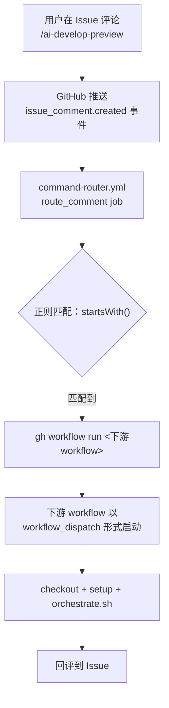

# backlog .ai-flow 命令系统解读

> 解读时间：2026-06-09

---

## 一、命令触发机制

backlog 的斜杠命令**不是 webhook**，而是通过 **`command-router.yml` 作为唯一入口**监听 GitHub Issue 事件，再通过 `workflow_dispatch` API 分发到下游 workflow。



核心设计要点：
- 所有 `issue_comment` 事件由 **router 统一监听**，不再让各下游 workflow 直接监听（避免每条评论产生大量 skipped 噪音记录）
- 下游 workflow 全部改为 **`workflow_dispatch`** 触发（仅 router 直接听事件）
- router 用 PAT（`GH_TOKEN`）调起 `gh workflow run`，因为 `GITHUB_TOKEN` 触发的 dispatch 不会真正启动新 run
- 评论内容中 `/ai-xxx` 后的文字被提取为 feedback 参数注入给 AI agent

---

## 二、完整命令清单

### 生命周期五阶段

```
[1] 需求分析 ──→ [2] 开发预览 ──→ [3] 开发提交 ──→ [4] 测试发布 ──→ [5] 正式上线
```

### Issue 评论命令（机器人触发 GitHub Actions）

| 阶段 | 命令 | 用途 | 对应 Workflow |
|------|------|------|-------------|
| [1] | `/ai-requirement-analysis [反馈]` | 启动需求分析，产出需求分析说明书 PR | `issue-1-analyze-requirement.yml` |
| [1] | `/project <label>` | 打归属标签（间接触发[1]） | `command-router.yml` → `issue-1` |
| [2] | `/ai-develop-preview [参数]` | 出设计文档 + 代码 + 预览 + 冒烟 | `issue-2-implement.yml` |
| [3] | `/ai-develop-submit [参数]` | 门禁 + 对抗 review + 测试 → 开代码 PR | `issue-2-implement.yml` |
| [4] | `/ai-deploy-test [参数]` | 构建镜像 → tag 归档 → ArgoCD → 集成测试 | `issue-3-release.yml` |
| [5] | `/ai-release-plan create <URL>` | 跨仓转发到 release-mgmt，新建发布计划 | `dispatch_release_plan.yml` |
| [5] | `/ai-release <service>` | 启动正式发布流水线（在 release-mgmt 仓） | `workflow_release.yml` |
| [5] | `/ai-release-guide` | 查看发布进度 | `workflow_release.yml` |
| [5] | `同意发布` | 人工审批放行 | `workflow_release_pipeline.yml` |

### `/ai-develop-preview` 参数

| 参数 | 行为 |
|------|------|
| 无参 | 正常预览：设计 → 开发 → 部署 → 冒烟 |
| `--design` | 只更新设计文档，不进入开发 |
| `--skip-design` | 设计冻结，不动设计文档，直接开发+预览 |
| `--deploy-only` | 仅重部署已有 issue-N-impl 分支预览 |
| `--pr <URL>` | 部署外部 PR 预览 |

### `/ai-develop-submit` 参数

| 参数 | 行为 |
|------|------|
| 无参 | 默认 1 轮 best-effort，只跑 gitleaks |
| `--allgate` | 跑全部 6 项 security-gate |

### `/ai-deploy-test` 参数

| 参数 | 行为 |
|------|------|
| 无参 | 跑全流程 |
| `force` | 强制重发，忽略 no-change |
| `<社区>` | 只发布指定社区（如 `ascend`、`openeuler`） |
| `build` / `deploy` / `it` | 只跑指定阶段 |

### release-mgmt 仓命令（正式发布阶段）

| 命令 | 用途 |
|------|------|
| `/ai-release <服务名>` | 启动该服务的连续发布流水线 |
| `/ai-release all` | 遍历 deploy order，逐个启动所有服务 |
| `/ai-release-guide` | 查看当前发布进度和下一步指引 |
| `/ai-release reset` | 重置发布进度 |
| `同意发布` | 人工门禁放行（流水线停在审批点时） |
| `/lgtm` / `/approve` | 给变更计划 PR 投票，达阈值后自动合入 |

### 本地 Claude Code 命令（不走 GitHub Actions）

| 命令 | 用途 |
|------|------|
| `/ai-design <Issue URL>` | 本地编写需求分析/架构设计/测试策略文档 |
| `/code-review <PR>` | 结构化代码检视，高/中/低分级输出报告 |

---

## 三、自动触发路径（无需命令）

| 触发条件 | 自动行为 |
|---------|---------|
| Issue 加 `project:<umbrella>` 标签 | 自动触发需求分析 |
| Issue 加 `accepted` 标签 | 自动触发开发预览 |
| Issue 创建/编辑 | 自动打 `project:` 标签（AI 分析归属） |
| Issue 标题 `[缺陷]` / `[任务]` | 跳过需求分析和设计文档，直接开发 |

---

## 四、关键设计细节

1. **单一入口 router**：消除每条评论产生多个 skipped workflow run 的噪音（#557 改进）
2. **Issue 类型分流**：`[需求]` 走全流程，`[缺陷]`/`[任务]` 跳过分析阶段
3. **硬门禁**：预览前检查需求分析说明书是否存在，不存在则自动改派命令
4. **跨仓联动**：`dispatch_release_plan.yml` 通过 `repository_dispatch` 跨仓触发 release-mgmt
5. **令牌隔离**：router 用 PAT 触发 dispatch，回评用 GITHUB_TOKEN
