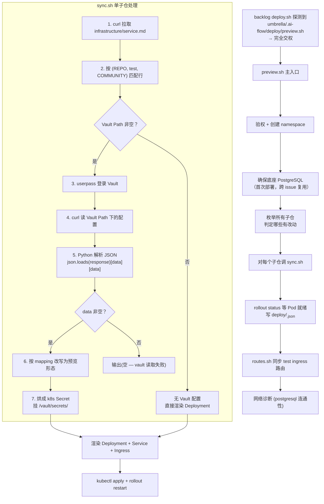
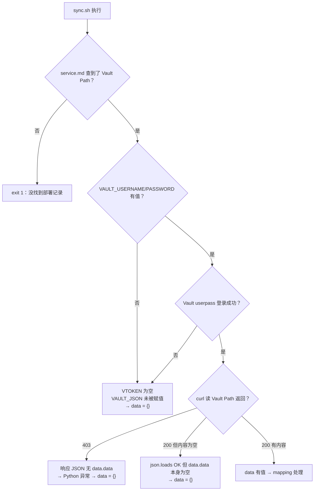

# forum-reply-robot .ai-flow 模块解读 —— 聚焦 Vault 处理链路

> 解读时间：2026-06-09

---

## 一、整体结构

forum-reply-robot 的 `.ai-flow/deploy/` 不依赖 backlog 的通用 runtime-clone deployer，而是有**自己完整的独立预览环境搭建方案**。backlog 的 `deploy.sh` 探测到 `umbrella/.ai-flow/deploy/preview.sh` 存在后，**完全交权**给 forum-reply-robot 自己处理。

```
.ai-flow/deploy/
├── preview.sh              # ★ 主入口（backlog 调这个）
├── services.yaml           # 业务拓扑 + 底座配置 + test 归档坐标
├── README.md               # 部署约定 + 6 个已知坑
└── test-sync/
    ├── sync.sh             # ★ 单子仓：service.md查Vault → 读配置 → 改写 → 烘Secret → runtime-clone Pod
    ├── routes.sh           # 同步 test ingress 路由拓扑到预览环境
    └── README.md           # test vs preview 差异对照表
```

---

## 二、完整调用链



---

## 三、Vault 处理 —— 逐步骤详解

### 步骤 1：从 service.md 查 Vault Path（sync.sh:31-59）

**forum-reply-robot 已修改过的关键差异**（对比 backlog 模板 `gen-preview-hook.sh`）：

| 对比项 | backlog 模板 | forum-reply-robot 实际 |
|--------|-------------|----------------------|
| service.md 来源仓库 | `opensourceways/infra-common` | `opensourceways/infrastructure` |
| 匹配方式 | 按 `(SUB子仓名, "test", COMMUNITY)` 三列精确匹配 | 按 `(REPO完整仓库名, "test")` —— 用 `repo in cols[4]` 在镜像构建源码仓 URL 中**模糊包含匹配** |
| 匹配列 | `cols[0]` = 微服务名 | `cols[4]` = 镜像构建源码仓 |

代码逻辑（`:36-53`）：

```python
# col[1]=环境 col[4]=镜像构建源码仓 col[5]=Vault Path
if cols[1]!='test': continue
if repo not in cols[4]: continue       # ← 关键：REPO 必须包含在 cols[4] URL 中
if community in cols[5]: best=cols; break
# 输出 vault_path, vault_keys, test_ns
```

**注意**：`REPO` 传入的是完整格式如 `opensourceways/forum-reply-robot`，在 cols[4]（如 `https://github.com/opensourceways/forum-reply-robot`）中做 `in` 匹配 —— 这种模糊匹配可能存在多个相似 repo 名匹配到同一行的风险。

### 步骤 2：Vault userpass 登录（sync.sh:62-69）

```bash
VTOKEN="$(curl -s --max-time 20 -X POST \
  "${VAULT_ADDR}/v1/auth/userpass/login/${VAULT_USERNAME}" \
  -d "{\"password\":\"${VAULT_PASSWORD}\"}" | \
  python3 -c '...print(json.load(sys.stdin).get("auth",{}).get("client_token",""))')"
```

- `VAULT_USERNAME` / `VAULT_PASSWORD` 来自 backlog secret（由 workflow 注入环境变量）
- Vault 地址：`https://vault.preview.test.osinfra.cn`
- 登录成功后从响应 JSON 提取 `auth.client_token`

### 步骤 3：读 Vault 配置（sync.sh:70-73）

```bash
if [ -n "$VTOKEN" ]; then
  VAULT_JSON="$(curl -s --max-time 20 -H "X-Vault-Token: $VTOKEN" \
    "${VAULT_ADDR}/v1/${VAULT_PATH}")"
fi
```

- 如果 VTOKEN 为空（登录失败） → VAULT_JSON 为空字符串 → 后续 Python 解析时 `data = {}`
- curl `-s` 静默模式 —— 即使返回 403 也不会报错，错误信息被完全吞掉

### 步骤 4：Python 解析 Vault JSON（sync.sh:80-117）

这是最核心的改造步骤。**forum-reply-robot 已经补全了 mapping**（不再是模板的空 `{}`）：

```python
mapping = {"config":"config", "secrets":"secrets.yaml"}
```

解析链路：

```
json.loads(VAULT_JSON) → ["data"]["data"] → 得到 key-value 字典
     ↓ 异常则 data = {}
     ↓
遍历 mapping: 如果 Vault 中有 config key → 取内容 → 改写 → 写文件 config
             如果 Vault 中有 secrets key → 取内容 → 改写 → 写文件 secrets.yaml
```

**改写规则（forum-reply-robot 定制版）**：

| 文件名 | Vault Key | 改写内容 |
|--------|-----------|---------|
| `secrets.yaml` | `secrets` | **database 块**：host→`postgresql-service.<ns>.svc.cluster.local`、port→5432、user→postgres、password→预览底座密码、database→底座库名（`forum_reply_robot`）；域名 `.test.osinfra.cn`→`.preview.test.osinfra.cn` |
| `config` | `config` | **域名替换**：`.test.osinfra.cn`→`.preview.test.osinfra.cn` |

**与 backlog 模板的关键差异**：

| 改写项 | backlog 模板（meeting-server） | forum-reply-robot |
|--------|-------------------------------|-------------------|
| DB 类型 | MySQL（3306，键大写 `HOST/PORT/USER/PASSWORD/NAME`） | PostgreSQL（5432，键小写 `host/port/user/password/database`） |
| config 改写 | `DEBUG=true` + `IS_DELETE_CONFIG=false`（Django 项目） | 只做域名替换（Flask 项目，不需要 DEBUG） |
| mapping | 空 `{}`（待补全） | `{"config":"config","secrets":"secrets.yaml"}`（已补全） |

### 步骤 5：烘 k8s Secret（sync.sh:119-128）

```
kubectl create secret generic <deploy-name>-config -n <ns> \
  --from-file=config=<渲染后的config文件> \
  --from-file=secrets.yaml=<渲染后的secrets.yaml>
```

### 步骤 6：注入 Pod（sync.sh:162,173,185）

Pod 启动流程中，Vault 配置被挂载并直接使用：

```yaml
env:
  - { name: CONFIG_PATH, value: /vault/secrets/config }
volumeMounts:
  - { name: vault-secrets, mountPath: /vault/secrets, readOnly: true }
volumes:
  - { name: vault-secrets, secret: { secretName: <deploy-name>-config } }
```

Pod 启动脚本（`:167-175`）：

```bash
git clone --depth 1 --branch "$BRANCH" "https://.../forum-reply-robot.git" /tmp/app
cd /tmp/app
cp /vault/secrets/config config/config.yaml    # ← 把 Vault 配置覆盖为应用配置文件
pip install --no-cache-dir -r requirements.txt
exec python main.py
```

**关键设计**：forum-reply-robot 的 `config.yaml` 是整个应用的所有运行参数（大模型 API key、数据库密码、论坛凭证等），预览 Pod 通过 `cp /vault/secrets/config config/config.yaml` 把 Vault 拉来的真实 test 环境配置**直接覆盖**到应用 config 目录下，然后启动应用。

---

## 四、你之前遇到的「vault data keys 为空」在此项目中的原因分析

结合 forum-reply-robot 的 sync.sh，data 为空的完整排查链：



**最常见的两种情况**：

1. **Vault policy 403**（最可能）：登录成功、读被拒 —— `curl -s` 静默吞错误 → `json.loads` 失败 → `data = {}`
2. **Vault 凭证未注入**：`VAULT_USERNAME` / `VAULT_PASSWORD` 环境变量为空 → `VTOKEN` 获取不到 → `VAULT_JSON` 未赋值 → Python 收到空串 → `data = {}`

**验证方法**（在 CI runner 上执行）：

```bash
# 1. 检查凭证是否存在
echo "VAULT_USERNAME=${VAULT_USERNAME:-<未设置>}"
echo "VAULT_PASSWORD=${VAULT_PASSWORD:-<未设置>}"

# 2. 登录
VTOKEN=$(curl -s --max-time 20 -X POST \
  "https://vault.preview.test.osinfra.cn/v1/auth/userpass/login/${VAULT_USERNAME}" \
  -d "{\"password\":\"${VAULT_PASSWORD}\"}" | python3 -c "import json,sys;print(json.load(sys.stdin)['auth']['client_token'])")

# 3. 读
curl -H "X-Vault-Token: $VTOKEN" \
  "https://vault.preview.test.osinfra.cn/v1/<你的VaultPath>"

# 4. 看返回 JSON 结构
# 成功：{"data":{"data":{"config":"...","secrets":"..."}}}
# 403： {"errors":["permission denied"]}
```

---

## 五、与 backlog 通用引擎的差异总结

| 维度 | backlog 通用模板（gen-preview-hook.sh） | forum-reply-robot 实际 |
|------|----------------------------------------|----------------------|
| service.md 源 | `opensourceways/infra-common` | `opensourceways/infrastructure` |
| 匹配列 | cols[0] 微服务名 | cols[4] 镜像构建源码仓 |
| DB 类型 | MySQL | PostgreSQL |
| config 改写 | Django 风格（DEBUG+域名） | Flask 风格（仅域名替换） |
| Vault mapping | 空 `{}`（待补全） | `{"config":"config","secrets":"secrets.yaml"}` |
| 镜像 | 通用 runtime-clone 语言探测 | 固定 `python:3.12-bookworm` + 手动安装 git/libpq-dev |
| 端口 | 默认 8080 | 固定 5000 |
| readiness | 无（backlog 通用模板） | tcpSocket:5000 + initialDelay:60s |

---

## 六、关键文件索引

| 文件 | 核心职责 |
|------|---------|
| `.ai-flow/deploy/preview.sh` | 主入口：验权→建namespace→底座PG→调sync.sh→网络诊断（227行） |
| `.ai-flow/deploy/test-sync/sync.sh` | Vault处理核心：service.md匹配→登录→读→改写→烘Secret→渲染Deployment（236行） |
| `.ai-flow/deploy/test-sync/routes.sh` | 同步test ingress路由拓扑到预览环境（70行） |
| `.ai-flow/deploy/services.yaml` | 业务拓扑：sub配置/底座PG/test归档坐标（40行） |
| `.ai-flow/deploy/README.md` | 部署约定+6个已知坑（47行） |
| `.ai-flow/deploy/test-sync/README.md` | test vs preview差异对照表（21行） |
